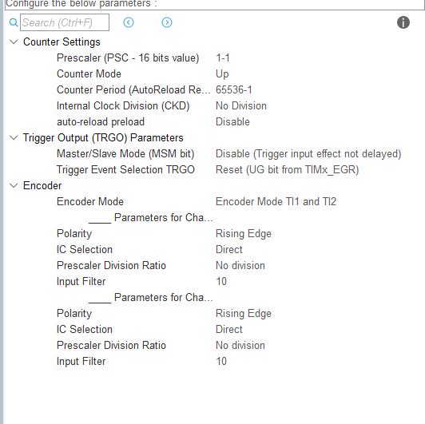

一阶倒立摆的PID控制和LQR控制 - 廖洽源的文章 - 知乎
https://zhuanlan.zhihu.com/p/54071212

你提供的公式是计算角度误差的一种常见方法，特别适用于处理角度的周期性（例如，0度和360度是同一个方向）。这条公式利用了反正弦函数（asin）和正弦函数（sin）的性质来得到一个范围在 −π/2 到 π/2 （或 -90度到 90度）之间的最小角度差。

这条公式的实现可以分解为以下几个步骤：

1. 计算角度差：

首先，计算参考角度 θ 
ref
​
  和当前位置角度 θ 
pos
​
  之间的直接差值：

delta_theta = theta_ref - theta_pos
这里的 θ 
ref
​
  和 θ 
pos
​
  可以是弧度或角度单位，但需要保持一致。

2. 计算角度差的正弦值：

接下来，计算这个角度差的正弦值：

sin_delta_theta = sin(delta_theta)
正弦函数将角度差映射到 -1 到 1 的范围内。

3. 计算反正弦值：

最后，对正弦值计算反正弦（arcsin 或 asin）：

theta_err = asin(sin_delta_theta)
反正弦函数 asin(x) 的返回值是使得 sin(theta_err) = x 的角度，并且返回值范围在 −π/2≤θ 
err
​
 ≤π/2 （或 −90 
∘
 ≤θ 
err
​
 ≤90 
∘
 ）。

为什么这种方法有效？

周期性处理： 由于正弦函数是周期性的（周期为 2π 或 360 
∘
 ），sin(θ) 和 sin(θ+2nπ) 的值是相同的，其中 n 是整数。直接计算 θ 
ref
​
 −θ 
pos
​
  可能会得到一个大于 π 或小于 −π 的角度差，但这并不代表实际的“最短旋转距离”。
最小角度差： asin(sin(x)) 的结果会将 x 映射到 [−π/2,π/2] 或 [−90 
∘
 ,90 
∘
 ] 的范围内。这意味着，即使 θ 
ref
​
  和 θ 
pos
​
  之间的直接差值很大，theta_err 也会给出它们之间绝对值最小的差值，并带有正确的符号（指示旋转方向）。
举例说明（角度单位）：

假设 θ 
ref
​
 =30 
∘
  和 θ 
pos
​
 =300 
∘
 。

直接差值： 30 
∘
 −300 
∘
 =−270 
∘
 
正弦值： sin(−270 
∘
 )=1
反正弦值： asin(1)=90 
∘
 
实际从 300 
∘
  旋转到 30 
∘
  的最短路径是逆时针旋转 90 
∘
 。

再举一个例子：θ 
ref
​
 =330 
∘
  和 θ 
pos
​
 =30 
∘
 。

直接差值： 330 
∘
 −30 
∘
 =300 
∘
 
正弦值： sin(300 
∘
 )=− 
2
3

​
 
​
 ≈−0.866
反正弦值： asin(−0.866)≈−60 
∘
 
实际从 30 
∘
  旋转到 330 
∘
  的最短路径是顺时针旋转 60 
∘
 。

在代码中实现：

大多数数学库都提供了 sin() 和 asin() 函数。你需要确保你的角度单位（弧度或度）与这些函数所期望的单位一致。通常，标准数学库中的三角函数使用弧度。如果你的角度是度，你需要先将其转换为弧度：

C

#include <math.h>

// 角度转弧度
double deg_to_rad(double deg) {
    return deg * M_PI / 180.0;
}

// 弧度转角度
double rad_to_deg(double rad) {
    return rad * 180.0 / M_PI;
}

// 计算角度误差 (弧度)
double angle_error_rad(double ref, double pos) {
    return asin(sin(ref - pos));
}

// 计算角度误差 (角度)
double angle_error_deg(double ref, double pos) {
    return rad_to_deg(asin(sin(deg_to_rad(ref) - deg_to_rad(pos))));
}
总结：

公式 θ 
err
​
 =asin(sin(θ 
ref
​
 −θ 
pos
​
 )) 是一种巧妙地计算两个角度之间最小有符号差值的方法，它能正确处理角度的周期性，并给出范围在 −π/2 到 π/2 或 −90 
∘
  到 90 
∘
  的误差，指示了从当前位置到目标位置的最短旋转方向和大小。这在需要精确角度控制的系统中非常有用，例如你的旋转倒立摆。

	// 映射角度
	Angle_Avg = encoder_agv * (360/NORM_BASE);

  if(time++ % 9 == 1){
		// 计算角度差值
		float Delta_Angle = Angle_Avg - Angle_last;
		logs[0] = Delta_Angle;
		float sin_delta_angle = sin(Delta_Angle);
		logs[1] = sin_delta_angle;
		float err_angle = asin(sin_delta_angle);
		logs[2] = err_angle;
		Angle_last = Angle_Avg;
		logs[3] = err_angle * 180.0 / M_PI;