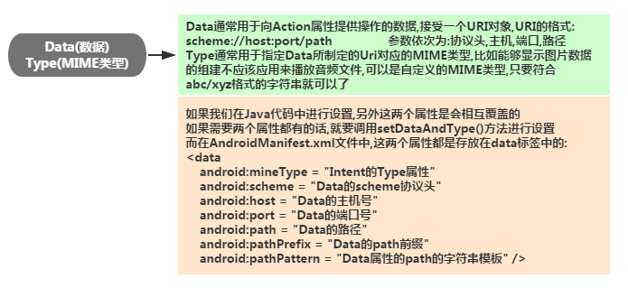
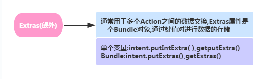

### 什么是intent
intent 翻译为意图，通常大家认为intent是Android四大组件中通信的桥梁。比如我们可以通过
- startActivity(Intent)/startActivityForResult(Intent)：来启动一个Activity
- startService(Intent)/bindService(Intent)：来启动一个Service
- sendBroadcast：发送广播到指定BroadcastReceiver
- 另外别忘了我们在注册四大组件时，写得很多的Intent-Filter哦~

#### 显性intent和隐形intent
- 显式Intent：通过组件名指定启动的目标组件,比如startActivity(new Intent(A.this,B.class)); 每次启动的组件只有一个~
- 隐式Intent:不指定组件名,而指定Intent的Action,Data,或Category,当我们启动组件时, 会去匹配AndroidManifest.xml相关组件的Intent-filter,逐一匹配出满足属性的组件,当不止一个满足时, 会弹出一个让我们选择启动哪个的对话框

#### intent的七个属性
1. 组件名称
    
2. Action（动作）
    
3. Category(类别)
    
4. Data(数据)，Type(MIME类型)
    
5. Extras(额外)
    
6. Flags(标记)
    