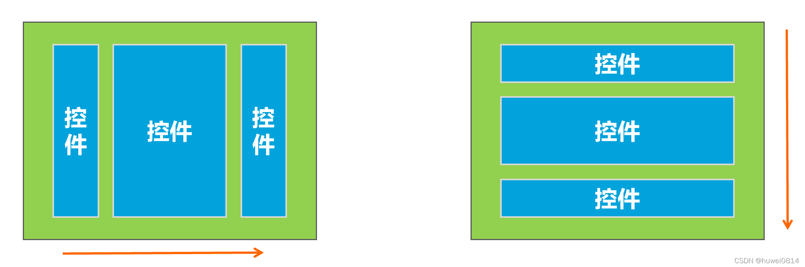

### 什么是线性布局？

简单的来说，线性布局（LinearLayout）就是主要以水平或垂直方式来排列界面中的控件。并将控件排列到一条直线上。在线性布局中，如果水平排列，垂直方向上只能放置一个控件，如果垂直排列，水平方向上也只能放置一个控件，如图所示：

在使用线性布局时，需要将布局的根标签改为LinearLayout，基本格式如下：
```xml
 
<LinearLayout xmlns:android="http://schemas.android.com/apk/res/android"
    xmlns:app="http://schemas.android.com/apk/res-auto"
    xmlns:tools="http://schemas.android.com/tools"
    android:layout_width="match_parent"
    android:layout_height="match_parent"
    tools:context=".MainActivity">
 ....
    
</LinearLayout>

```

#### 线性布局的调用/显示
当我们在一个activity中显示一个布局时，通常会使用
```java
setContentView(R.layout.first_layout);
```
其中，R是一个编译后的映射，布局和控件的id都会在其中被映射，便于全局调用。R.layout.first_layout指的就是在res资源文件夹下layout文件夹下的first_layout布局文件。

#### 如何设计线性布局

在<LinearLayout>根标签中，属性android:layout_width和android:layout_height来确定线性布局本身的尺寸，具体的来说：
- android:layout_width
  - 这个属性定义了线性布局在水平方向上的宽度
  - 通常该属性有三种取值
    - **match_parent**：使布局的宽度与其父布局的宽度相同
    - **wrap_content**：使布局的宽度适应其内容所需要的最小宽度
    - 具体的尺寸值，比如100dp
- android:layout_width
  - 这个属性定义了线性布局在垂直方向上的高度
  - 通常该属性有三种取值
    - **match_parent**：使布局的高度与其父布局的高度相同
    - **wrap_content**：使布局的高度适应其内容所需要的最小高度
    - 具体的尺寸值，比如100dp

**另外**：
- 这两个属性不仅适用于线性布局，也适用于所有的布局和空间。
- 当在LinearLayout中嵌套子View的时候，子View的layout_width和layout_height会决定子View在LinearLayout中占据的大小。如果LinearLayout的android:orientation属性为垂直，那么
LinearLayout会纵向排列子View，反之，如果android:orientation属性为水平，那么LinearLayout会横向排列子View。
- LinearLayout中，layout_weight属性，会决定子View在LinearLayout中占据剩余空间的比例


#### 线性布局的摆放方向

通常我们会使用android:orientation 属性来修改线性布局（LinearLayout）的摆放方向。其有两个取值，通常默认为horizontal（水平摆放方向）
- horizontal：水平方向摆放子视图。
- vertical：垂直方向摆放子视图。

#### 线性布局中的权重

通过前面的对线性布局的描述，我们可以知道线性布局会在某一个方向上摆放空间，那么，当控件数量过多时，就会导致先前的控件正常显示，而后面的控件发生堆叠

通常，我们在子控件中使用android:layout_weight属性来表示该子控件的权重，权重用来表示子控件对空间的抢占能力，如果每个子控件的权重相同，则控件会平均分配控件，不会造成前面的控件正常显示而后面的控件发生堆叠。


