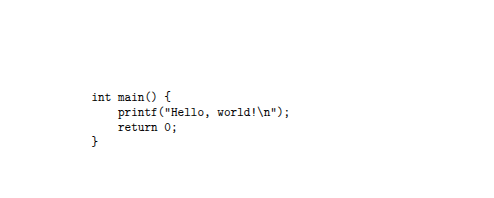
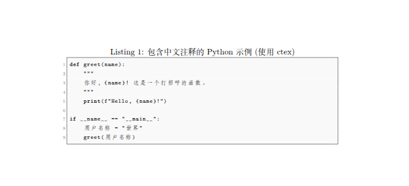

# Latex中书写代码块儿

在latex中书写代码块儿，准确的来说实际上是在latex中如何排版展示代码，主要有以下几种常见的方法。

## verbatim

verbatim是latex中的内置环境，用于逐字打印文本，包括特殊字符，空格，换行符。

- 优点:简单易用，无需额外宏包
- 缺点:功能有限，没有语法高亮，行号等高级功能
- 适用场景:短小的代码片段，程序输出，需要准确显示格式的文本

示例：

```latex
\documentclass{article}
\begin{document}

\begin{verbatim}
int main() {
    printf("Hello, world!\n");
    return 0;
}
\end{verbatim}

\end{document}
```




## listings

listings是latex中强大也最常用的用于处理代码展示的宏包

- 优点：支持众多编程语言的语法高亮、行号、自定义样式（字体、颜色、边框等）、标题、标签、断行等高级特性。可以通过 \lstset 进行全局配置，也可以在每个 lstlisting 环境中单独设置。
- 缺点：需要引入宏包
- 适用场景：需要清晰，美观的展示各种编程代码的场景，例如技术文档，报告等

示例：
```latex
\documentclass{article}
\usepackage{ctex} % 引入 ctex 宏包，提供中文支持
\usepackage{listings}
\usepackage{xcolor}

\begin{document}

\lstset{
    language=Python,
    basicstyle=\ttfamily\footnotesize,
    numbers=left,
    numberstyle=\tiny\color{gray},
    stepnumber=1,
    numbersep=5pt,
    backgroundcolor=\color{lightgray!10},
    showspaces=false,
    showstringspaces=false,
    showtabs=false,
    frame=single,
    rulecolor=\color{black!50},
    caption=包含中文注释的 Python 示例 (使用 ctex),
    label=lst:chinese_python_ctex
}

\begin{lstlisting}
def greet(name):
    """
    你好，{name}！这是一个打招呼的函数。
    """
    print(f"Hello, {name}!")

if __name__ == "__main__":
    用户名称 = "世界"
    greet(用户名称)
\end{lstlisting}

\end{document}
```




## minted
minted宏包基于pygments库，提供强大的语法高亮效果，支持的语言和样式丰富。
- 优点：语法高亮出色
- 缺点：需要安装Python和Pygments库，配置相对复杂，编译时通常需要启用外部命令
- 适用场景：对代码高亮具有较高要求

示例
```latex
\documentclass{article}
\usepackage{minted}

\begin{document}

\begin{minted}{c++}
#include <iostream>

int main() {
    std::cout << "Hello, world!" << std::endl;
    return 0;
}
\end{minted}

\end{document}
```

由于我使用的是overleaf，因此咩有对这个方式进行尝试。

后面的，有点懒，今天不想弄了。