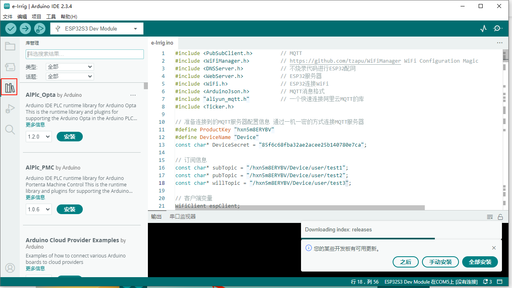
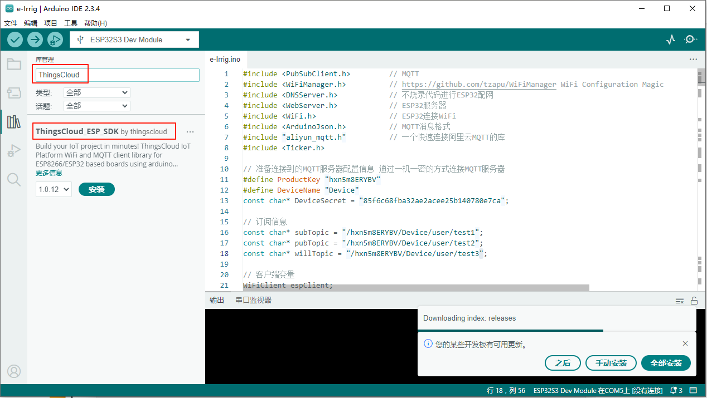
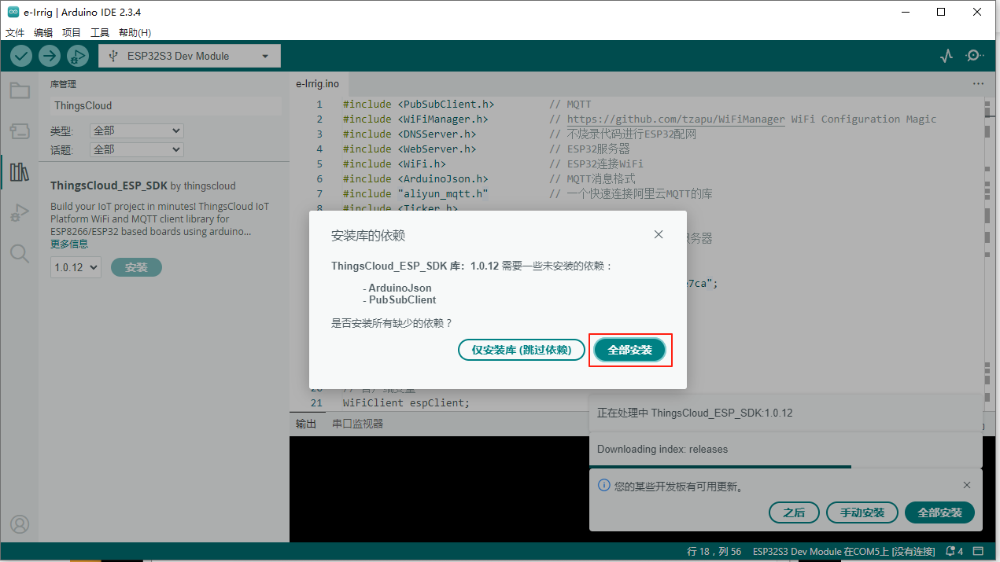
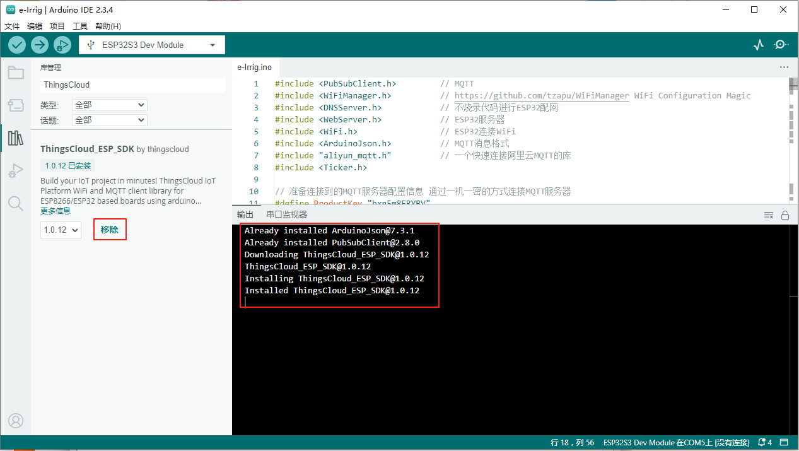

# ThingsCloud ESP32/ESP8266 Arduino SDK

> 详细代码和流程参见github连接：https://github.com/IoT-ThingsCloud/thingscloud-esp-sdk

众所周知，ESP系列WIFI功能单片机风靡全球，在物联网开发应用中被广泛使用，支持Arduino框架。
ThingsCloud 推出了基于 ESP32/ESP8266 Arduino 的 SDK，方便智能硬件厂商和开发者快速将设备接入 ThingsCloud 云平台并生成物联网应用，完成物联网方案的快速落地。
SDK 支持特性包括：

- WiFi 基本连接，指定 WiFi SSID/Password，连接到固定 AP。
- WiFi 配网，可使用 ThingsX iOS/Android App，为模组快速配置 WiFi 连接信息。适合多设备的量产。
- MQTT 一机一密，为每个模组烧录独立的证书。
- MQTT 一型一密，为所有模组烧录相同的固件，每个模组自动获取证书。适合多设备的量产。
- 支持 ThingsCloud MQTT 接入协议，几行代码就可以实现设备和云平台的双向数据实时传输，包括属性上报和下发、事件上报、命令接收、自定义数据流等。
- 固件 OTA 升级，结合 ThingsCloud 的 OTA 版本管理功能。

使用 SDK 开发的示例：

- ESP32 + DHT11/DHT22 温湿度传感器接入 ThingsCloud
- ESP32 + 继电器模块接入 ThingsCloud

## Arduino库安装
通过 Arduino 库管理器可以快速安装 SDK，以 Arduino 2.3.4 为例，进入 Arduino 点击右侧工具栏的库管理，如下图：

在搜索框中输入 ThingsCloud，出现 ThingsCloud_ESP_SDK，点击安装，使用默认的最新版本。如下图：

如果相关的依赖库没有安装，则会提示是否安装其它依赖库，选择安装全部。如下图：

安装成功后，如下图：

## 示例程序
在安装完库后，可以将鼠标移到库名旁，点击出现的三点符号，再点击示例，可以打开示例代码
### 01.WIFI_Basic
普通 WiFi 连接方式，指定 WiFi SSID 和密码。

- mqtt_connect_with_access_token：每个设备使用自己的 AccessToken 连接 ThingsCloud
- mqtt_connect_with_device_key：每个设备使用 DeviceKey 请求 AccessToken，连接 ThingsCloud
- mqtt_connect_with_device_key_auto_create_device：每个设备使用 DeviceKey 请求 AccessToken，连接 ThingsCloud。如果 DeviceKey 的设备不存在，支持自动创建设备。
- mqtt_connect_with_auto_device_key：每个设备自动生成唯一的 DeviceKey，请求 AccessToken，连接 ThingsCloud。

### 02.WiFi_Provisioning_AP_Mode
不需要指定 WiFi SSID 和密码，用户通过 ThingsX App 完成 WiFi 配网。

- wifi_provisioning_cliam_device：WiFi 配网模式的示例，用户完成配网后领取设备。
- wifi_provisioning_reset：通过长按按键重置配网的示例。

### 03.MQTT_Communicate
设备 MQTT 通信示例。

- mqtt_attributes：设备上报设备属性、接收云平台下发属性、读取云平台的设备属性。
- mqtt_report_event：设备上报事件的示例。
- mqtt_recv_command：设备接收云平台下发命令的示例。

### 10.IoT_Tutorials
应用示例。

- dht_sensor：dht11/21/22 温湿度传感器上报数据。ESP32 + DHT11/DHT22 温湿度传感器接入 ThingsCloud
- relay_control：ThingsCloud 下发控制继电器。ESP32 + 继电器模块接入 ThingsCloud
- dtu_uart_stream：实现透传 DTU，主控 MCU 可通过 UART 和 ESP32 UART1 通信，云平台设备使用自定义数据流，支持二进制、文本、JSON，可通过规则引擎和设备属性进行互转。支持 WiFi 配网。
- dtu_uart_json：实现透传 DTU，主控 MCU 可通过 UART 和 ESP32 UART1 通信，上下行数据使用 JSON 格式，实现设备属性上报和属性下发。支持 WiFi 配网。
- command_ota：使用 ThingsCloud OTA，实现 ESP32 固件升级。