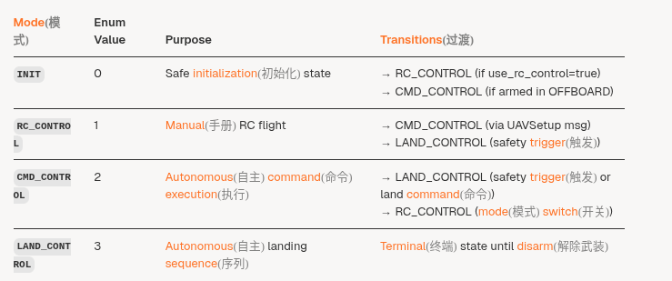
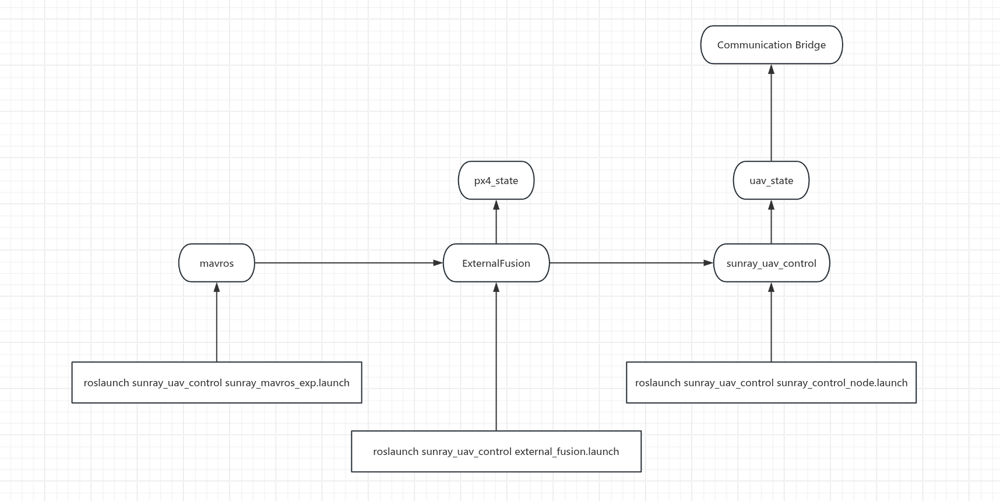
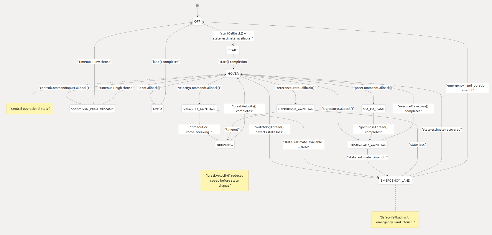

上次开会时讨论的有关Sunray重构的一些要点

- gazebo仿真和Sunray主体分离(Sunray的主体是什么？)
- 比赛/项目中发掘出来的一些新功能如何与Sunray主体更好地结合？(做一个扩展商店这样的东西？)
- 所有的启动脚本需要重新看一遍？
- 
- 构造一个全局生效的配置文件，直观且方便的管理系统的所有参数(无人机自身id号，雷达的ip，自身的wifi等)
  - 是否有可能通过这个yaml文件进行联网？

[General_Module/sunray_uav_control/launch/sunray_control_node.launch1-79](https://github.com/YunDrone-Team/Sunray/blob/8362c7dc/General_Module/sunray_uav_control/launch/sunray_control_node.launch#L1-L79)

##### Sunray_Control

几个重要的msg的定义和流向

external_fusion：这个包在目前的Sunray项目中是用于获取外部定位源，得到定位源的数据后进行数据的处理，比如将坐标轴进行变换，得到标准的ROS里程计坐标系，然后通过Mavros给到PX4的外部里程计融合接口，使得px4可以进入到position模式

uav_control：状态机并不以飞行状态作为划分，而是以Control_Mode进行划分，默认进入到uav_control后强制进入px4的position模式，并且无法通过遥控器切换模式。

