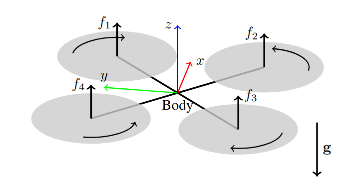
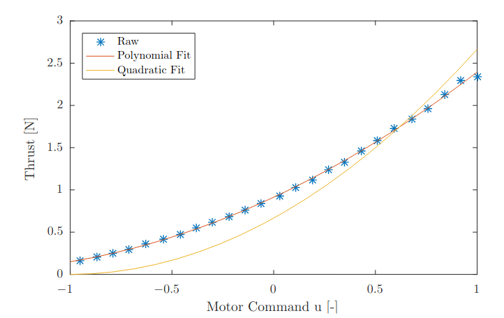
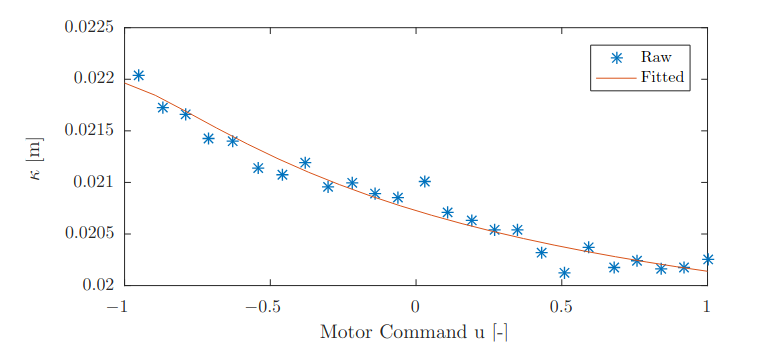

# Thrust Mixing, Saturation, and Body-Rate Control for Accurate Aggressive Quadrotor Flight

> 推力混合，饱和和机体速度控制实现精确攻击性四旋翼飞行

### Abstract 绪论

四旋翼飞行器非常适合高加速度的快速机动，但是如果不事先迭代学习，飞行器无法达到厘米级精度的快速轨迹。在本文中，我们提出了一种新型的bodyrate控制和thrust mising方案，他们分别在不需要学习的情况下，提高了轨迹跟踪性能，并减少了四旋翼的Yaw角控制误差。此外，据我们所知，我们提出了第一个通过优先考虑与稳定和轨迹跟踪控制相关的控制输入来巧妙的应对运动饱和算法。提出的bodyrate控制器使用了LQR控制方法来考虑bodyrate和单个电机的动态特性，这将低了总体气动跟踪误差，同时很好的抑制了外部干扰。我们的迭代thrust mixing方案根据来自位置控制器的输入计算四个螺旋桨产生的推力。通过迭代计算，我们能够考虑单个螺旋桨在其输入范围内的推力和阻力扭矩变化比，这允许更精确的应用所需要的yaw控制扭矩从而减少yaw角的控制误差。我们优先考虑电机饱和方案以提高四旋翼飞行过程中的稳定性和鲁棒性，并可以防止电机饱和情况下的不稳定行为，我们在现实世界的四旋翼飞行实验展示了改进的轨迹跟踪，yaw角控制以及电机饱和情况下的鲁棒性

#### 补充材料

一段视频显示了用四螺旋桨进行的实验，可在https://youtu.be/6YEMxFgToyg查看

### Introduction 介绍

#### Motivation 动机

近年来，自主四旋翼因其敏捷机动性而变得非常受欢迎，敏捷机动性指的是四旋翼无人机可以执行侵略性的机动。如果四旋翼至少有一个电机在执行飞行任务期间接近饱和，我们认为估计是侵略性的，这种情况常见于需要大的线加速度或者角加速度。即使在今天，当使用四旋翼进行如此激进的轨迹时，如果事先不进行重新规划或者迭代学习机动，跟踪误差可能会很大。

使用四旋翼进行精确轨迹跟踪的核心是bodyrate控制器，其跟踪所需要的bodyrate，这些bodyrate通常是由高级控制器所计算出来的。只有在很好的跟踪所需的bodyrate时，四旋翼才能精确的应用其所需的姿态，并由此精确的应用所需的推力方向，从而事先精确的平移。为了实现良好的bodyrate跟踪，精确的应用单个螺旋桨的推力至关重要，从而正确的应用所需的body推力和归一化推力。

为了充分的利用四旋翼的高灵活性，需要设计积极的轨迹。然而，轨迹设计的过程中，在尝试利用整个可行的电机输入范围时很难保证可行性，即使对于电机饱和度可行的轨迹也不能保证跟踪控制器会不会计算由于与期望轨迹的偏差过大而导致超过其极限的电机输入，如果一个或多个电机发生这种饱和情况，四旋翼可能会大幅的偏离其参考轨迹，甚至在处理不当的情况下变得不稳定。

#### Contribution 贡献

本文的工作是三方面的。首先，我们使用LQR方法设计了一个新型的bodyrate控制器，该控制器考虑了带有螺旋桨的单个电机的动态特性。与之前的控制器相比，它在保持相同抗干扰抑制性能的同时改善了轨迹跟踪。其次，本文改进了单螺旋桨推力的计算，从而达到了比最先进的方法更精确的达到反馈控制器给出的四旋翼主题上的期望yaw角扭矩，为此，我们认为单个螺旋桨的推力和阻力扭矩之比在整个输入范围内并不是恒定的。第三，本文提高了四旋翼的稳定性和在电机输入饱和情况下的鲁棒性，我们通过对单螺旋桨推力应用饱和方案来解决这个问题，该方案根据所需的body 推力和collective推力与稳定四旋翼和跟踪轨迹的相关性，优先考虑所需的bodyrate推力和collective推力。

###  System Overview 系统概述

我们考虑一个这样的四旋翼：它被建模为一个由四个单螺旋桨推力$f_i$控制的刚性体，如下图所示，通过改变这四个单螺旋桨推力 $f_i$可以在四旋翼的主体body上施加三轴扭矩$\eta$和质量标准化机体推力$c$。单个单个螺旋桨的推力与总的推力和body推力的关系可以根据下图的坐标系公式化为

$$
\begin{aligned}
\boldsymbol{\eta} &= \begin{bmatrix} 
\frac{\sqrt{2}}{2}l(f_1 - f_2 - f_3 + f_4) \\ 
\frac{\sqrt{2}}{2}l(-f_1 - f_2 + f_3 + f_4) \\ 
\kappa_1 f_1 - \kappa_2 f_2 + \kappa_3 f_3 - \kappa_4 f_4 
\end{bmatrix}, \\
mc &= f_1 + f_2 + f_3 + f_4,
\end{aligned}
$$
其中$l$是四旋翼的臂长，或者说单个电机到机体中心的距离，$\kappa_i = \kappa(f_i)$是与单个螺旋桨的阻力扭矩和推力相关的系数，$m$是四旋翼的质量。值得注意的是，我们认为螺旋桨的阻力扭矩$\kappa$是螺旋桨产生推力$f_i$的函数，而非一个常数，这与一些论文中的观点不符。

我们将单个电机产生的推力$f$和阻力扭矩$\tau$建模为电机输入的二次方程
$$
\begin{aligned}
f(u) &= k_2^f u^2 + k_1^f u + k_0^f, \\
\tau(u) &= k_2^\tau u^2 + k_1^\tau u + k_0^\tau,
\end{aligned}
$$
其中系数$k_i^f$和$k_i^{\tau}$是通过拉力传感器上固定带有螺旋桨的电机，并测量产生的力和扭矩来确定的。电机输入$u$对应我们可以在[-1,1]范围中发送给ESC(电子调速器)的命令，我们选择三个系数，因为它比仅用二次项对螺旋桨推力和阻力扭矩进行建模更加的逼近测量值，如下图所示

### BodyRateControl 机体速率控制

由于我们使用的硬件架构具有两个CPU，因此我们对控制器进行了拆分以适应硬件架构，分别用于四旋翼上的高级控制和低级控制。高级控制用于计算期望的bodyrate，低级控制对其进行跟踪。在本节中，我们提出了一种新型的bdoy-rate控制器，该控制器通过考虑电机的动力学来提高bodyrate的跟踪性能。我们通过为包含bodyrate和body扭矩作为状态的动态系统设计LQR控制器来实现这一目标，该控制器的输入是期望的bodyrate $\omega_{des}$和期望的质量标准化集体推力$c_{des}$,我们假设这些期望变量是从高级位置控制器输出的。

四旋翼的bodyrate $\omega$可以定义为
$$
\dot \omega = J^{-1} \cdot (\eta - \omega *J\omega)
$$
其中$J$是四旋翼的转动惯性矩。此外，我们将单个螺旋桨的推力的动力学建模为一阶系统
$$
\dot{f} = \begin{cases} 
\frac{1}{\alpha_{up}} (f_{des} - f) & \text{if } f_{des} \geq f \\ 
\frac{1}{\alpha_{dwn}} (f_{des} - f) & \text{if } f_{des} < f 
\end{cases},
$$
其中的$\alpha_{up}$和$\alpha_{dwn}$是通过将阶跃输入应用到负载传感器上带有单个螺旋桨的电机来确定的。从这些称重传感器的实验中，我们发现，当电机上下旋转时，单螺旋桨推力的动态特性有很大的不同。

现在我们可根据上面两个公式来建立一个状态$s = [\omega^T,\eta^T]$以及输入$u = \eta_{des}$，为了简化模型，我们将螺旋桨的时间常数进行一次近似，我们尝试逼近$\alpha_{up} = \alpha_{dmn} = \alpha$，但是在实践中我们发现，$a = (\alpha_{up}+\alpha_{dmn})/2$是一个很好的近似值，这是因为，为了改变body的扭矩，我们使用了旋转方向相反的电机，其中一个旋转向上，另一个旋转向下。此外，我们通过将$\kappa$逼近为恒定且不取决于螺旋桨的推力来简化了$\eta_{z}$的动态特性，从而导致了body的扭矩动态特性为
$$
\dot \eta = \frac{1}{\alpha}(\eta_{des} - \eta)
$$
值得注意的是，这些动态特性的简化对于反馈控制器的设计来说是必要的，对于$\dot \omega$ 和 $\dot \eta$来说，在$\omega = 0$ 和 $\eta = 0$处进行线性化，可以得到
$$
\begin{bmatrix} \dot{\boldsymbol{\omega}} \\ \dot{\boldsymbol{\eta}} \end{bmatrix} = 
\begin{bmatrix} 
\mathbf{0} & \boldsymbol{J}^{-1} \\ 
\mathbf{0} & -\frac{1}{\alpha}\mathbf{I}_3 
\end{bmatrix} 
\begin{bmatrix} \boldsymbol{\omega} \\ \boldsymbol{\eta} \end{bmatrix} + 
\begin{bmatrix} \mathbf{0} \\ \frac{1}{\alpha}\mathbf{I}_3 \end{bmatrix} \boldsymbol{\eta}_{des}
$$
基于此，我们可以用它来设计无限时域上的 LQR控制器的控制律$u = -K_{lqr}s$从而最小化代价函数
$$
\int \mathbf{s}^T \mathbf{Q} \mathbf{s} + \mathbf{u}^T \mathbf{R} \mathbf{u} \, dt,
$$
其中$Q$是对角化的权重矩阵，$R$是单位矩阵，一个公式化的LQR问题的解是以下形式的增益矩阵
$$
\mathbf{K}_{lqr} = \begin{bmatrix} 
k_{\omega_{xy}} & 0 & 0 & k_{\eta_{xy}} & 0 & 0 \\ 
0 & k_{\omega_{xy}} & 0 & 0 & k_{\eta_{xy}} & 0 \\ 
0 & 0 & k_{\omega_z} & 0 & 0 & k_{\eta_z} 
\end{bmatrix},
$$
其对应于一个机体速率的 PD 控制器。此外，我们加入了前馈项，使得在满足 $\dot{\boldsymbol{\omega}} = \dot{\boldsymbol{\omega}}_{des}$ 的条件下达到 $\boldsymbol{\omega}_{des}$，最终得到的控制策略为
$$
\boldsymbol{\eta}_{des} = \mathbf{K}_{lqr} \begin{bmatrix} \boldsymbol{\omega}_{des} - \hat{\boldsymbol{\omega}} \\ \boldsymbol{\eta}_{ref} - \hat{\boldsymbol{\eta}} \end{bmatrix} + \hat{\boldsymbol{\omega}} \times \boldsymbol{J}\hat{\boldsymbol{\omega}} + \boldsymbol{J}\dot{\boldsymbol{\omega}}_{des}
$$
其中，$\eta_{ref} = \omega_{des} * J\omega_{des} + J\dot\omega_{des}$，向量$\hat \omega$是通过飞控板载的陀螺仪估计的机体速率，而$\hat\eta$是通过估计单个螺旋桨的推力，并将其转换为了body的扭矩从而获得的估计body扭矩，请注意，该估计使用了螺旋桨推力的非对称模型，即$\alpha_{up} != \alpha_{dwn}$，而在控制器的设计中，我们假设$\alpha_{up} = \alpha_{dwn}$，另外注意，如果可以获得旋转速度的真实反馈，则可以改进这种估计。在我们刚推出的控制器中，$\hat\omega * J\hat\omega$提供反馈线性化，补偿body速率动态中的耦合项，并且项$J\dot\omega_{des}$可以用作期望角加速度的前向反馈，该角加速度可以根据要追踪的轨迹计算，这是由四旋翼的微分平坦特性所决定的。
