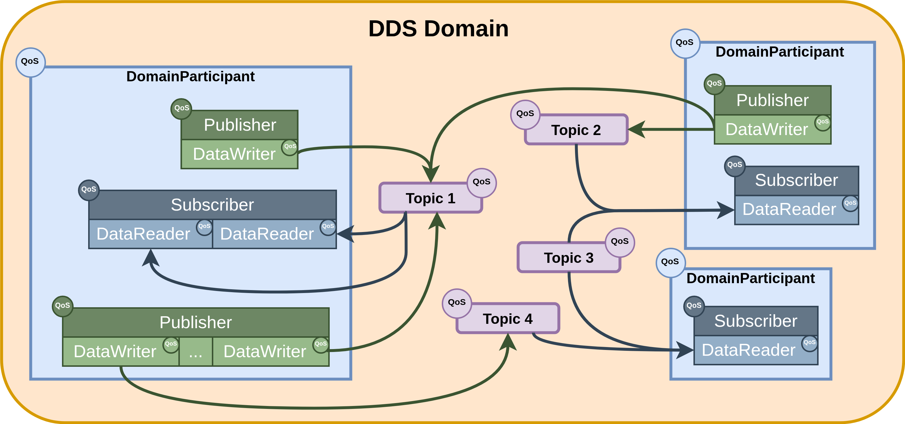
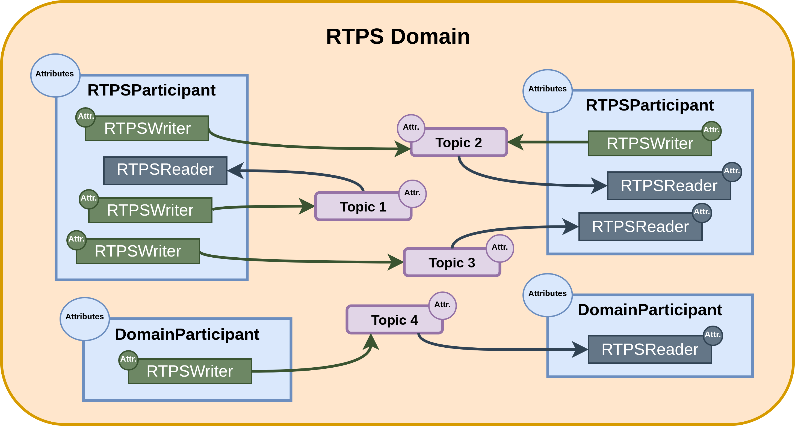

# ubuntu20 FastDDS 2.14.4
> 2.14.4是FastDDS V2的最后一个版本，由于Humble中使用的是FastDDS V2，因此宿主机中安装这个版本
> FastDDS link:https://fast-dds.docs.eprosima.com/en/v2.14.4/fastdds/getting_started/definitions.html

## 什么是DDS

DDS全称为Data Distribution Service，也就是数据分发服务。本质上来说，DDS是一种以数据为中心的通信协议，用于分布式软件应用程序之间的通信。他描述了通信应用程序编程接口(API)以及通信语义，这些接口和语义使得数据的发布者和订阅者之间能够进行通信。

由于DDS采用的是Data-Centric Publish Subscribe (DCPS) 即"以数据为中心的发布-订阅"模型，其实现过程中定义了三个关键的应用实体:
- 发布实体：负责定义信息的发布对象以及其属性，即谁产生数据，数据类型是什么。
- 订阅实体：负责定义信息的订阅对象及其属性，即谁订阅数据，需要什么样的数据类型。
- 配置实体：负责定义以“话题”形式传输的信息类型，并创建带有服务质量QoS属性的发布者和订阅者，从而保证上述实体能够正常运行。 

DDS通过服务质量QoS来定义DDS实体(如发布者，订阅者，话题等)的行为特征，QoS由一系列独立的QoS策略组成，这些策略在“Policy”(策略规范)中进行了详细的描述

### DCPS概念模型
在DCPS模型中，定义了四个基本要素，用于开发通信应用系统。
- Publisher:发布者 (Publisher) 是负责创建和配置其所实现的 数据写入者 (DataWriter) 的 DCPS（数据分发发布订阅）实体。数据写入者 (DataWriter) 则是负责消息实际发布的实体。每个 DataWriter 都会被分配一个特定的话题 (Topic)，消息将在该话题下发布。
- Subscriber:订阅者 (Subscriber) 是负责接收在其订阅的话题下所发布数据的 DCPS 实体。它为一个或多个 数据读取者 (DataReader) 对象提供服务，而 DataReader 则负责向应用程序通知新数据的可用性（即“数据到货”）。
- Topic:话题 (Topic) 是连接发布和订阅的实体。它在同一个 DDS 域 (Domain) 内是唯一的。通过话题描述 (TopicDescription)，它能够确保发布端和订阅端之间数据类型的一致性。
- Domain:域 (Domain) 是用于连接属于一个或多个应用程序的所有发布者和订阅者的概念，这些程序在不同的下话题交换数据。参与到一个域中的这些独立应用程序被称为 域参与者 (DomainParticipant)。
  - DDS 域通过 域 ID (Domain ID) 进行标识。域参与者通过定义域 ID 来指定其所属的 DDS 域。具有不同 ID 的两个域参与者在网络中是互不感知的。因此，可以创建多个互不干扰的通信通道。这适用于涉及多个 DDS 应用程序的场景：各应用内部的域参与者可以彼此通信，但不同应用之间必须互不干扰。
  - 域参与者 (DomainParticipant) 充当其他 DCPS 实体的容器，同时也是发布者、订阅者和话题实体的工厂（创建者），并在域内提供管理服务。

## 什么是RTPS

实时发布订阅（RTPS）协议是专为支持 DDS（数据分发服务）应用而开发的。它是一种基于“尽力而为”传输层协议（如 UDP/IP）的发布-订阅通信中间件。此外，Fast DDS 还提供了对 TCP 和共享内存（SHM）传输的支持。

该协议旨在同时支持**单播（Unicast）和多播（Multicast）**通信。

在 RTPS 的顶层，继承自 DDS 概念的是 域（Domain）。域定义了一个独立的通信平面，多个域可以同时独立存在。一个域包含任意数量的 RTPS 参与者（RTPSParticipants），即能够发送和接收数据的实体。

为了实现数据传输，RTPS 参与者使用其**端点（Endpoints）**进行操作：

RTPSWriter：能够发送数据的端点。

RTPSReader：能够接收数据的端点。

一个 RTPS 参与者可以拥有任意数量的写入者（Writer）和读取者（Reader）端点。

通信的核心围绕着**话题（Topics）**展开，话题定义并标识了所交换的数据。话题不属于特定的参与者。参与者通过 RTPSWriter 修改在某个话题下发布的数据，并通过 RTPSReader 接收其所订阅主题的相关数据。

通信的基本单位被称为更改（Change），它代表了在某一特定主题下写入的数据更新。RTPSReader 和 RTPSWriter 会将这些更改记录在它们的**历史记录（History）**中，这是一种作为近期更改缓存的数据结构。

在 eProsima Fast DDS 的默认配置下，当你通过 RTPSWriter 端点发布一个“更改”时，后台会执行以下步骤：

该“更改”被添加到 RTPSWriter 的历史缓存中。

RTPSWriter 将该“更改”发送给它所已知的所有 RTPSReader。

RTPSReader 在接收到数据后，用新的“更改”更新其历史缓存。

然而，Fast DDS 支持多种配置，允许你改变 RTPSWriter 和 RTPSReader 的行为。对 RTPS 实体默认配置的修改意味着 RTPSWriter 与 RTPSReader 之间数据交换流的改变。此外，通过选择不同的服务质量（QoS）策略，你可以从多个维度影响这些历史缓存的管理方式，但基本的通信闭环保持不变。