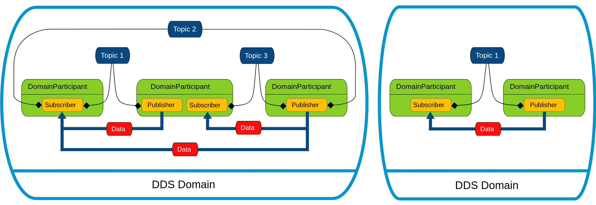

# Introduction

## eProsima Fast DDS Documentation

eProsima Fast DDS 是由对象管理组织（OMG）定义的 DDS（数据分发服务） 规范的 C++ 实现。eProsima Fast DDS 库不仅提供了应用程序编程接口（API），还提供了一种部署了**以数据为中心的发布者-订阅者（DCPS）**模型的通信协议，旨在实时系统之间建立高效且可靠的信息分发。

eProsima Fast DDS 在资源处理方面具有可预测性、可扩展性、灵活性和高效性。为了满足这些要求，它采用了类型化接口，并依赖于一种多对多分布式网络范式，该范式能够巧妙地实现通信中发布端与订阅端的解耦。

eProsima Fast DDS 包含以下部分：

- DDS API 实现。
- Fast DDS-Gen：一种用于将类型化接口与中间件实现进行桥接的生成工具。
- 底层 RTPS 线载协议实现。

基于上述所有特点，eProsima Fast DDS 已被选为 ROS2 所有长期支持（LTS）版本以及大多数非 LTS 版本中支持的默认中间件。

## DDS API

DDS 采用的通信模型是一种多对多单向数据交换，其中产生数据的应用程序将数据发布到属于消费数据应用程序的订阅者本地缓存中。信息流由负责数据交换的实体之间建立的服务质量 (QoS) 策略进行调节。

作为一个以数据为中心 (Data-centric) 的模型，DDS 构建在所有相关应用程序均可访问的“全局数据空间 (Global Data Space)”概念之上。想要贡献信息的应用程序声明其成为发布者 (Publishers) 的意图，而想要访问数据空间部分内容的应用程序则声明其成为订阅者 (Subscribers) 的意图。每当发布者向该空间发布新数据时，中间件就会将信息传播给所有感兴趣的订阅者。

通信跨越域 (Domains) 进行，即连接所有能够相互通信的分布式应用程序的隔离抽象平面。只有属于同一个域的实体才能进行交互，而订阅数据的实体与发布数据的实体之间的匹配是由主题 (Topics) 介导的。主题是明确的标识符，它将域内唯一的名称与数据类型以及一组特定的 QoS 策略关联起来。

DDS 实体被建模为类或类型化接口 (Typed Interfaces)。后者意味着更高效的资源处理，因为在执行前预知数据类型允许提前分配内存，而不是进行动态分配。

## Fast DDS-Gen

依赖接口意味着需要一种生成工具，将类型描述转换为合适的实现，从而填补接口与中间件之间的空白。这一任务由专门的生成工具 Fast DDS-Gen 完成。它是一个 Java 应用程序，能够根据 接口定义语言 (IDL) 文件中定义的数据类型生成相应的源代码。

## RTPS Wire Protocol

eProsima Fast DDS 在标准网络上交换消息所使用的协议是实时发布-订阅协议 (RTPS)。这是一种由 OMG 联盟定义并维护的 DDS 互操作性线载协议。该协议提供了基于 TCP/UDP/IP 等传输层的发布者-订阅者通信，并保证了不同 DDS 实现方案之间的兼容性。

鉴于 RTPS 协议源自发布-订阅模式，且其规范设计旨在满足与 DDS 应用领域相同的需求，因此它能够与许多 DDS 概念相映射，自然而然地成为了 DDS 实现的首选。所有 RTPS 核心实体都关联于一个 RTPS 域 (Domain)，该域代表了一个端点（Endpoints）进行匹配的隔离通信平面。RTPS 协议中指定的实体与 DDS 实体具有一一对应的关系，从而使通信得以实现。

