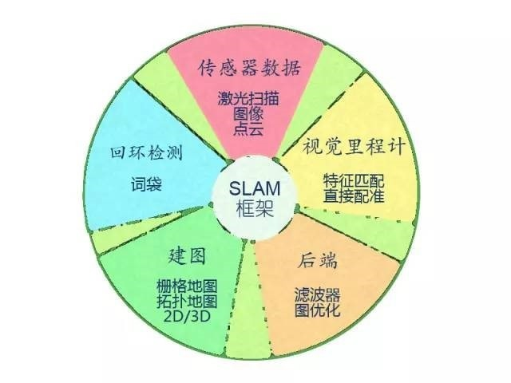
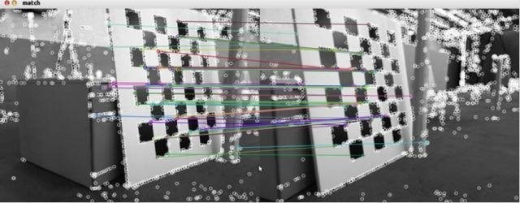

# SLAM基础知识

## SLAM的前世今生

近来年，智能机器人技术在世界范围内得到了大力发展。人们致力于把机器人用于实际场景：从室内的移动机器人，到野外的自动驾驶汽车、空中的无人机、水下环境的探测机器人等等，均得到了广泛的关注。

### SLAM的前世

在导航与定位领域，一开始注重高精度的惯性导航，卫星导航，星光制导及其组合导航。

定位、定向、测速、授时是人们惆怅千年都未能完全解决的问题，最早的时候，古人只能靠夜观天象和司南来做简单的定向。直至元代，出于对定位的需求，才华横溢的中国人发明了令人叹为观止的牵星术，用牵星板测量星星实现纬度估计。

1964年美国投入使用GPS，突然就打破了大家的游戏规则。军用的P码可以达到1-2米级精度，开放给大众使用的CA码也能够实现5-10米级的精度。

后来大家一方面为了突破P码封锁，另一方面为了追求更高的定位定姿精度，想出了很多十分具有创意的想法来挺升GPS的精度。利用RTK的实时相位差分技术，甚至能实现厘米的定位精度，基本上解决了室外的定位和定姿问题。

然而室内，上述定位方法就难以取得较好的效果了，为了实现高精度的室内定位，一大批新技术不断涌现。其中，SLAM技术脱颖而出。

### SLAM的今生

**SLAM** 全称为 **Simultaneous Localization and Mapping**，也就是即时(同步)定位与地图构建。SLAM指的是机器人在自身位置不确定的条件下，在完全未知的环境中创建地图，同时利用该地图进行自主定位和导航。
- Localization (定位)：机器人必须知道自己在环境中的未知
- Mapping (建图)：机器人必须记录环境中的特征的位置(在知道自身位置的情况下)
- SLAM ：机器人在定位的同时建图，其基本原理是通过概率估计的方法，通过多特征匹配来达到定位和减少建图误差。

SLAM问题也可以描述为：机器人在未知环境中从一个未知的位置开始移动，在移动过程中根据自身位置估计和传感器数据进行自身定位，同时构建出增量式地图。

## 传感器

当我们谈论起SLAM时，最先提到的就是传感器。SLAM的实现方式与难度和**传感器的形式与安装方式密切相关**。传感器分为**激光**和**视觉**两大类。而在视觉下面又分为三个小类别。

### 激光雷达

激光雷达是最古老，也是研究最多的传感器。它们提供了机器人本体同周围环境间的距离信息。常见的激光雷达，如SICK，Velodyne，Livox，rplidar等，都可以用来实现SLAM。激光雷达能够以很高的精度测量出周围障碍点的角度和距离，从而方便的实现SLAM，避障等功能。

主流的2D激光传感器扫描一个平面内的障碍物，适用于平面运动的机器人（如扫地机等）进行定位，并建立**2D的栅格地图**。这种地图在机器人导航中很实用，因为多数机器人还不能在空中飞行或走上台阶，仍限于地面。在SLAM研究史上，早期SLAM研究几乎全使用激光传感器进行建图，且**多数使用滤波器方法**，例如卡尔曼滤波器与粒子滤波器等。

激光雷达的优点是精度高，速度快，计算量不大，可以实现实时SLAM，缺点则是价格昂贵。同时，应用于激光雷达的EKF-SLAM理论方面研究趋于成熟，于此同时，人们对EKF-SLAM的缺点也有一定的认识，比如不同意表示回环，线性化误差严重，必须维护路标点的协方差矩阵，导致一定的时间和空间的开销等。

### 视觉SLAM

视觉SLAM是21世纪SLAM研究热点之一，一方面是因为视觉十分直观，不免令人觉得：为何人能通过眼睛认路，机器人就不行呢？另一方面，由于CPU、GPU处理速度的增长，使得许多以前被认为无法实时化的视觉算法，得以在10 Hz以上的速度运行。硬件的提高也促进了视觉SLAM的发展。

就传感器而言，视觉SLAM研究分为三大类：单目，双目(或多目)，RGBD。其余还有一些小类，比如鱼眼，全景，以及结合惯性测量器件(IMU)的视觉SLAM也是热门的研究方向。

#### 单目SLAM

单目SLAM也就是用单目相机所实现的SLAM，简称为Mono SLAM。这样做的好处是传感器特别的简单，成本特别的低，所以Mono SLAM非常受研究者关注。相比与其他传感器，单目最大的问题是缺失了深度信息。

一方面，由于绝对深度未知，Mono SLAM无法得到机器人的运动轨迹以及地图的真实大小。直观的说，如果把轨迹和房间同时放大两倍，单目相机得到的画面是一样的。因此，Mono SLAM只能估计出一个相对的深度，在相似变换空间Sim(3)中求解,而非传统的欧式空间SE(3)。如果我们要在SE(3)中求解，则需要借助一些外部手段，比如IMU信息，GPS信息，动捕或是RTK等定位信息，来确定轨迹与地图的尺度。

另一方面，单目相机无法靠一张图像来获得图像中物体离自己的距离。为了估计这个相对深度，Mono SLAM需要靠运动中的三角测量来求解相机运动并估计像素的空间位置。也就是说，Mono SLAM的轨迹和地图，只有在相机运动后才会收敛，如果相机不进行运动，则无法得到像素的位置。同时，相机不能是纯粹的旋转运动，否则求解的过程中会出现问题。

#### 双目SLAM

相比于单目相机，双目相机通过两个相机之间的baseline(基线)来估计空间点的位置。与单目不同的是，立体视觉既可以在运动时估计深度，也可以在静止时估计深度，因此消除了Mono SLAM的很多缺点。但是，双目相机的标定也是一个麻烦事，同时通过双目图像计算像素距离是一件非常消耗计算量的事情，因此现在多用FPGA实现并行处理。

#### RGBD SLAM
RGBD是2010年左右兴起的相机，它最大的特点是通过红外结构光或者Time of Flight原理，直接测出图像中各像素同相机的距离。因此RGBD相对于原来的相机能够得到更多的信息，不必像单目或者是双目那样费时费力的计算深度。由于RGBD相机还存在测量范围窄，噪声大，视野小等诸多问题，主要还是在室内SLAM中使用的多一些。

## 视觉SLAM框架

视觉SLAM通常都有一个基本的框架，一个视觉SLAM系统分为四个模块：VO(Vision Odometry 视觉里程计)，后端，建图，回环检测。

### Vision Odometry 视觉里程计

Visual Odometry，即视觉里程计。它估计两个时刻机器人的相对运动（Ego-motion）。在激光SLAM中，我们可以将当前的观测与全局地图进行匹配，用ICP求解相对运动。而对于相机，它在欧氏空间里运动，我们经常需要估计一个三维空间的变换矩阵——SE3或Sim3（单目情形）。**求解这个矩阵是VO的核心问题**，而求解的思路，则分为基于特征的思路和不使用特征的直接方法。

#### 基于特征
**基于特征的方法是目前VO的主流方式。**对于两幅图像，首先提取图像中的特征，然后根据两幅图的特征匹配，计算相机的变换矩阵。最常用的是点特征，例如Harris角点、SIFT、SURF、ORB。如果使用RGBD相机，利用已知深度的特征点，就可以直接估计相机的运动。给定一组特征点以及它们之间的配对关系，求解相机的姿态，该问题被称为PnP问题（Perspective-N-Point）。PnP可以用非线性优化来求解，得到两个帧之间的位置关系。
> Harris (Harris Corner Detector)角点检测:基于图像局部窗口的灰度变化（通过矩阵特征值判断角点）。
> SIFI (Scale-Invariant Feature Transform):通过高斯差分金字塔（DoG）检测尺度空间极值点。
> SURF (Speeded-Up Robust Features):使用Hessian矩阵近似（盒式滤波器替代高斯滤波）。
> ORB (Oriented FAST and Rotated BRIEF):改进的FAST角点检测（添加方向信息）。

#### 不基于特征
不使用特征进行VO的方法称为直接法。它直接把图像中所有像素写进一个位姿估计方程，求出帧间相对运动。例如，在RGBD SLAM中，可以用ICP（Iterative Closest Point，迭代最近邻）求解两个点云之间的变换矩阵。对于单目SLAM，我们可以匹配两个图像间的像素，或者像图像与一个全局的模型相匹配。直接法的典型例子是SVO和LSD-SLAM。它们在单目SLAM中使用直接法，取得了较好的效果。目前看来，直接法比特征VO需要更多的计算量，而且对相机的图像采集速率也有较高的要求。

### 后端

在VO估计帧间运动之后，理论上就可以得到机器人的轨迹了。然而视觉里程计和普通的里程计一样，存在累积误差的问题（Drift）。直观地说，在t1和t2时刻，估计的转角比真实转角少1度，那么之后的轨迹就全部少掉了这1度。时间一长，建出的房间可能由方形变成了多边形，估计出的轨迹亦会有严重的漂移。所以在SLAM中，还会把帧间相对运动放到一个称之为后端的程序中进行加工处理。

早期的SLAM后端使用滤波器方式。由于那时还未形成前后端的概念，有时人们也称研究滤波器的工作为研究SLAM。SLAM最早的提出者R. Smith等人就把SLAM建构成了一个EKF（Extended Kalman Filter，扩展卡尔曼滤波）问题。他们按照EKF的形式，把SLAM写成了一个运动方程和观测方式，以最小化这两个方程中的噪声项为目的，使用典型的滤波器思路来解决SLAM问题。

当一个帧到达时，我们能（通过码盘或IMU）测出该帧与上一帧的相对运动，但是存在噪声，是为运动方程。同时，通过传感器对路标的观测，我们测出了机器人与路标间的位姿关系，同样也带有噪声，是为观测方程。通过这两者信息，我们可以预测出机器人在当前时刻的位置。同样，根据以往记录的路标点，我们又能计算出一个卡尔曼增益，以补偿噪声的影响。于是，对当前帧和路标的估计，即是这个预测与更新的不断迭代的过程。

21世纪，SLAM研究者开始借鉴SfM（Structure from Motion）问题中的方法，把捆集优化（Bundle Adjustment）引入到SLAM中来。优化方法和滤波器方法有根本上的不同。它并不是一个迭代的过程，而是考虑过去所有帧中的信息。通过优化，把误差平均分到每一次观测当中。在SLAM中的Bundle Adjustment常常以图的形式给出，所以研究者亦称之为**图优化方法**（Graph Optimization）。图优化可以直观地表示优化问题，可利用稀疏代数进行快速的求解，表达回环也十分的方便，因而成为现今**视觉SLAM中主流的优化方法**。

### 回环检测

回环检测，又称闭环检测（Loop closure detection），是指机器人识别曾到达场景的能力。如果检测成功，可以显著地减小累积误差。**回环检测实质上是一种检测观测数据相似性的算法。**对于视觉SLAM，多数系统采用目前较为成熟的词袋模型（Bag-of-Words, BoW）。词袋模型把图像中的视觉特征（SIFT, SURF等）**聚类**，然后建立词典，进而寻找每个图中含有哪些“单词”（word）。也有研究者使用传统模式识别的方法，把回环检测建构成一个分类问题，训练分类器进行分类。

回环检测的难点在于，错误的检测结果可能使地图变得很糟糕。这些错误分为两类：

- 假阳性（False Positive），又称感知偏差（Perceptual Aliasing），指事实上不同的场景被当成了同一个；
- 假阴性（False Negative），又称感知变异（Perceptual Variability），指事实上同一个场景被当成了两个。

感知偏差会严重地影响地图的结果，通常是希望避免的。一个好的回环检测算法应该能检测出尽量多的真实回环。研究者常常用准确率-召回率曲线来评价一个检测算法的好坏。

