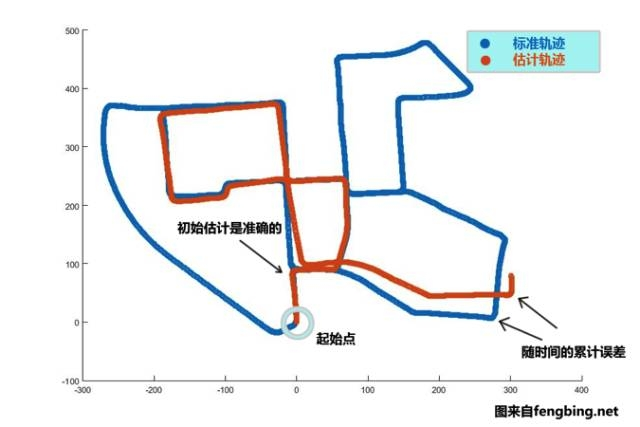
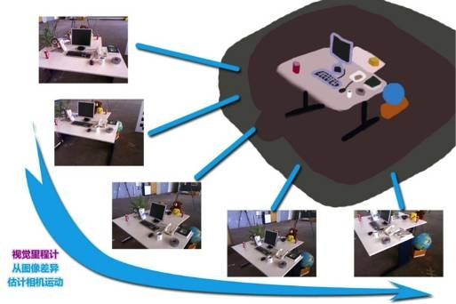

# 视觉里程计

## 什么是里程计

当我们想要得到一个机器人的运动轨迹的时候，我们可以通过多种方式来实现。例如，我们在汽车轮胎上安装计数码盘，就可以得到轮胎转动的距离，从而得到汽车的状态估计，或者说测量汽车的速度，加速度，通过时间积分来得到它的位移。

完成这种运动估计(包括算法和硬件)的装置叫做**里程计**，里程计的英文是Odometry，通常简写为Odom

### 里程计的特性

里程计有一个很重要的特性，就是它只关心在局部时间上被测对象的运动，多数时候指的是两个时刻间的运动。当我们以某种时间间隔对运动状态进行采样时，就可以估计运动物体在各个时间间隔之内的运动状态。由于这个估计收到噪声的影响，先前时刻的估计误差会积累到后面的运动上，这种现象称之为漂移(Drift)。

漂移现象是我们不希望看到的，他会扰乱我们对全局轨迹的估计。但是，如果没有其他矫正机制，而只有局部运动的情况下，漂移是里程计无法避免的现象之一。

## 什么是视觉里程计

如果一个里程计主要依靠视觉组件，比如单目，双目相机。我们就称其为视觉里程计。

和传统里程计一样，视觉里程计面临的最主要的问题就是从几个相邻的图像之间，估计出相机的运动。

相邻图像之间的相似性，为我们估计相机运动提供了依据。目前，视觉里程计的主要估计方法有两种，分别是基于特征点的方法和不基于特征点的直接法。特征点方法也被称为稀疏方法，而使用特征点描述的方法也叫稠密法。